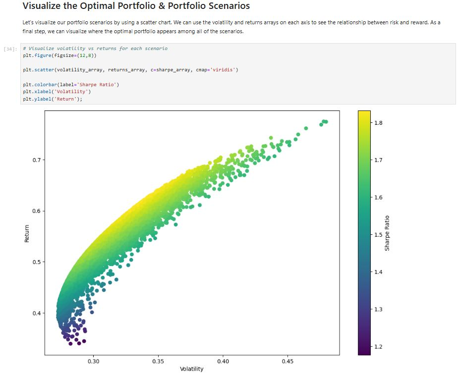
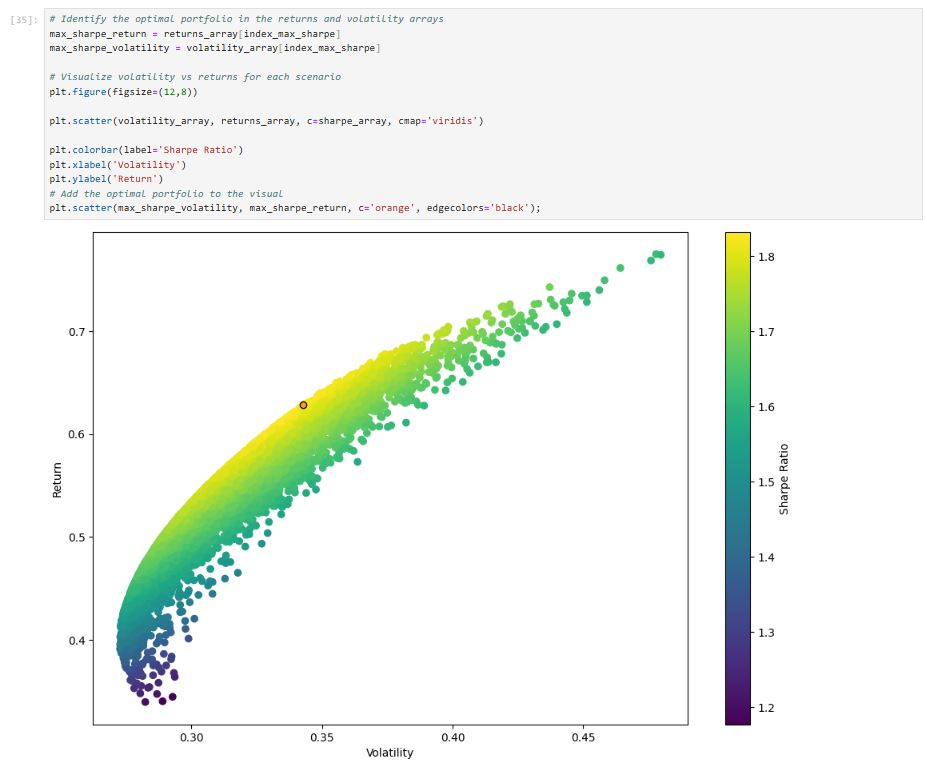

## Project Description:
In this project I build two $10,000 investment portfolios using four stocks: AAPL, AMD, MSFT and ORCL.  
- The first portfolio has equal weighting between the stocks.  
- The second portfolio is optimized for best return adjusted for risk (max Sharpe ratio).

## Features
- Pull 2 years of stock data 
- Calculate daily returns and portfolio performance
- Simulate 10,000 portfolios with random weights
- Identify optimal portfolio and visualize results

## Data
I used data from 4 CSV files, one for each stock, containing all historical data needed for the analysis.

# Portfolio Optimization Project  
[View Portfolio Optimization Notebook](https://github.com/JaviGARES/Python-Case-Study---Portfolio-Optimization/blob/main/Case%20Study%20-%20Portfolio%20Optimization.ipynb)

Here are some snapshots from the project:

