# Case-Study---Portfolio-Optimization-with-Python

This project builds and compares two $10,000 portfolios for four stocks:
1. Equal-weighted portfolio
2. Optimized portfolio (max Sharpe ratio)

## Features
- Pull 2 years of stock data using Yahoo Finance
- Calculate daily returns and portfolio performance
- Simulate 10,000 portfolios with random weights
- Identify optimal portfolio and visualize results

# Portfolio Optimization Project
  
📥 Download the file to explore it in Jupyter notebook:  
[Portfolio_Optimization.ipynb](Portfolio_Optimization.ipynb) 

## Project Preview

Here are some snapshots from the project:

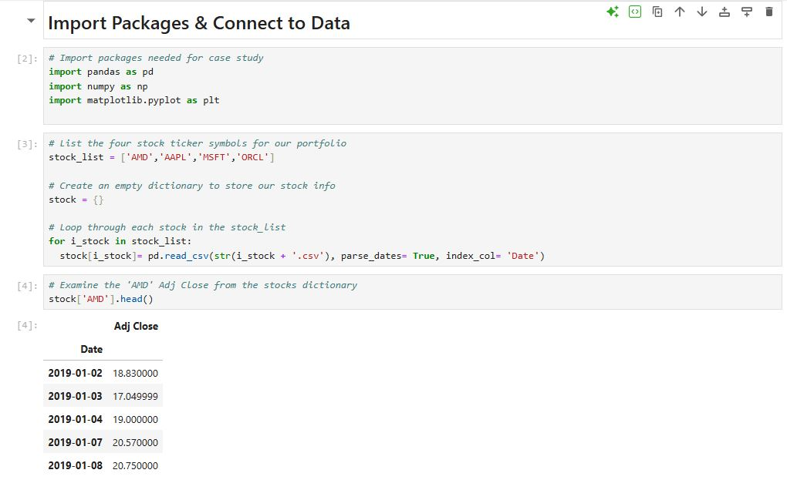
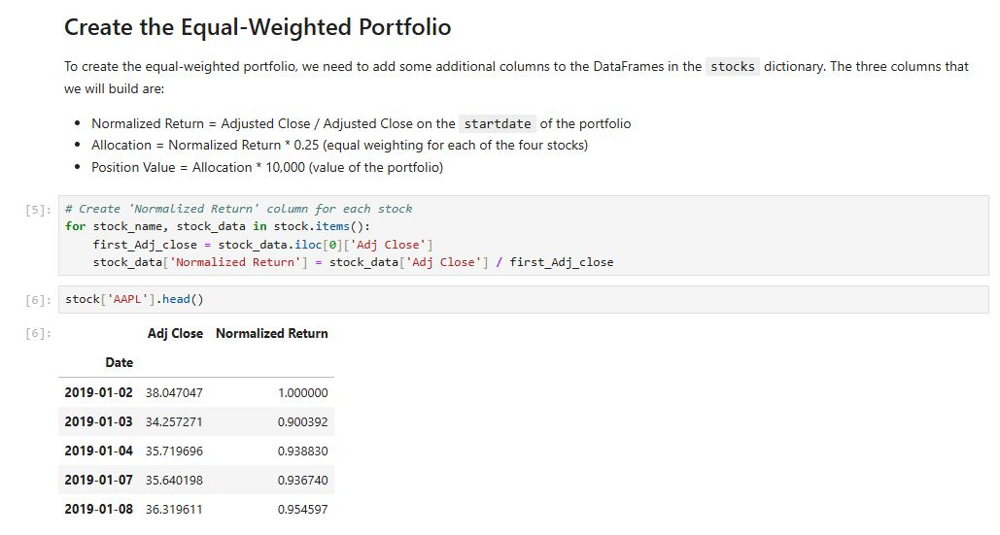
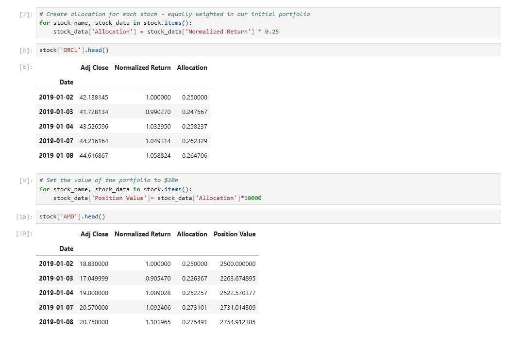
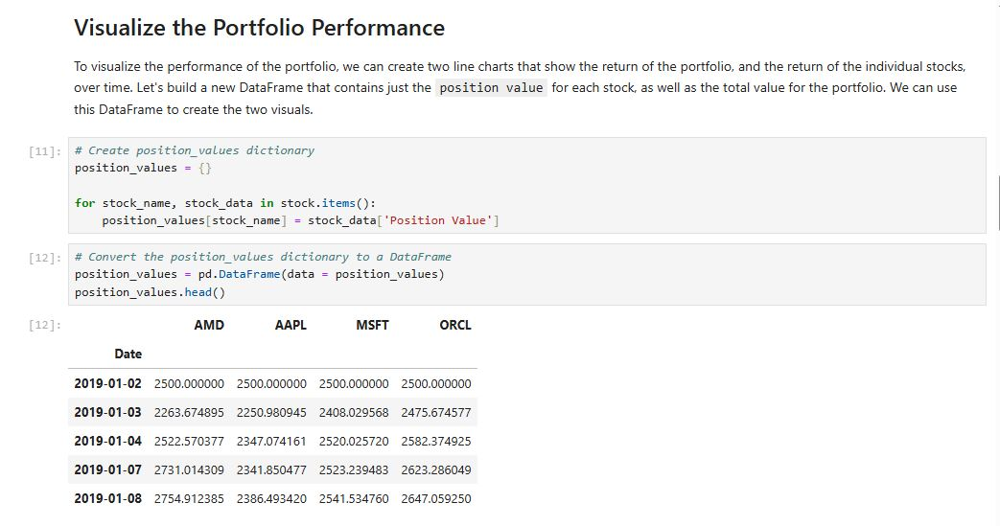
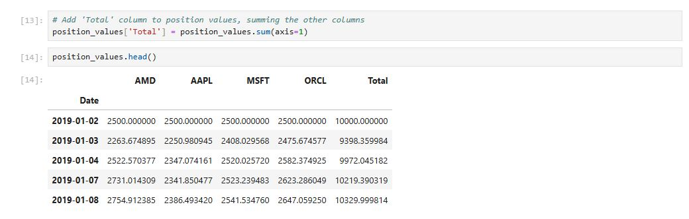
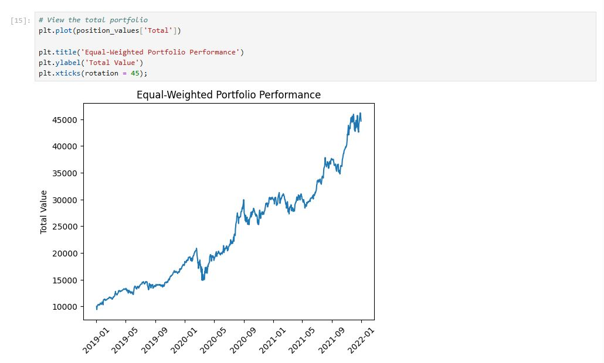
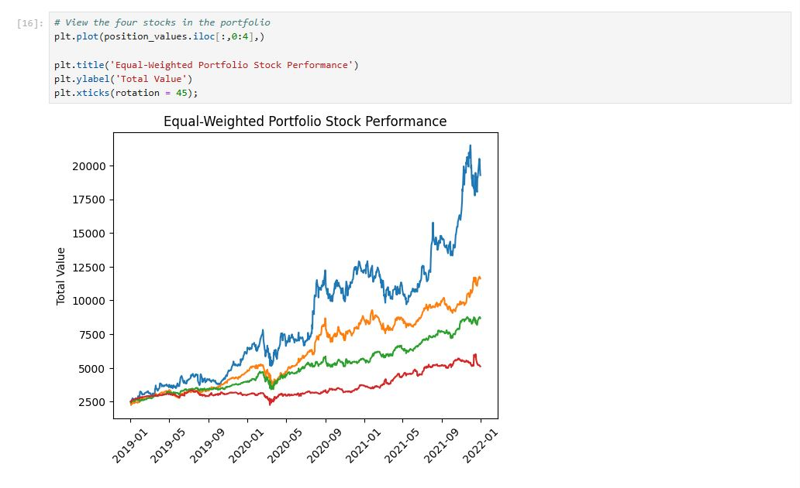
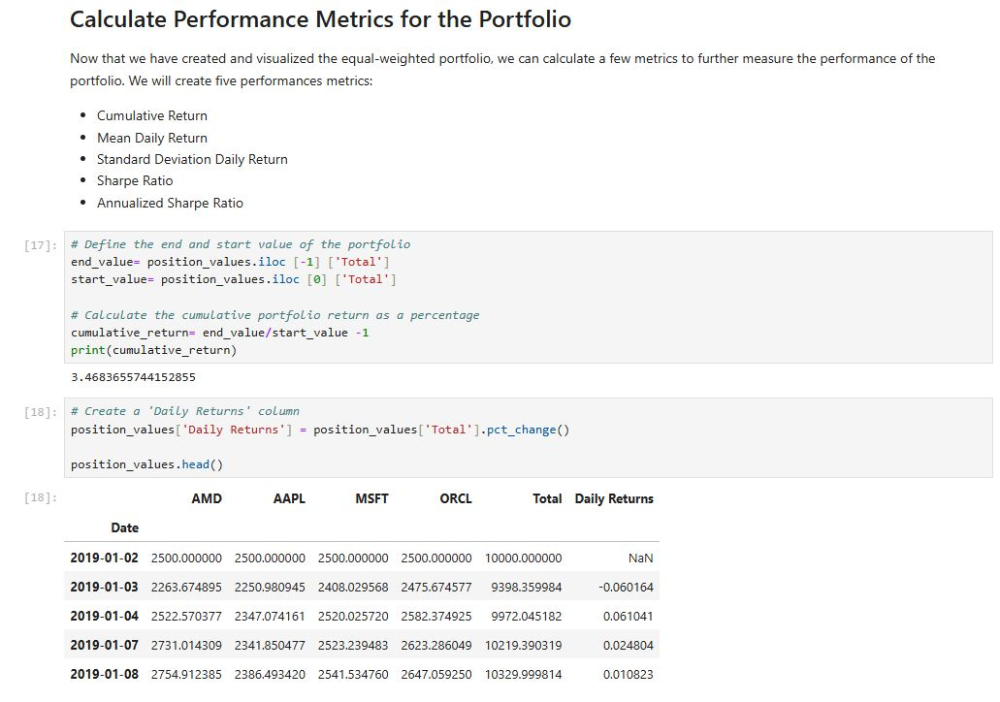
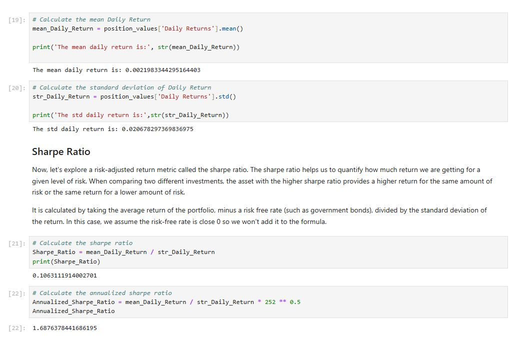
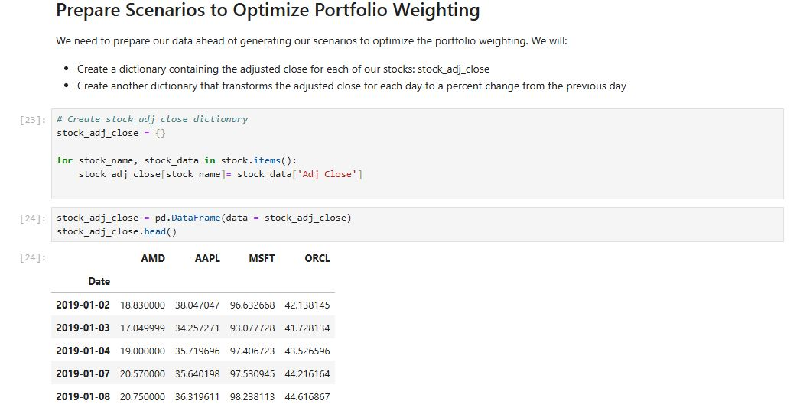
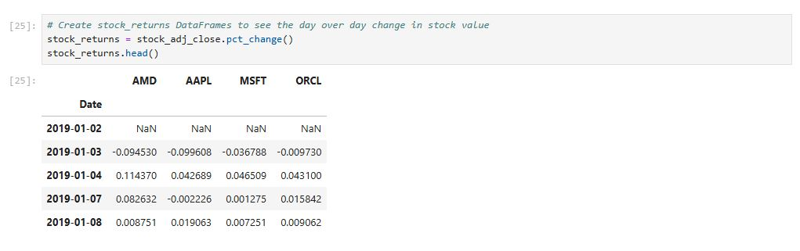
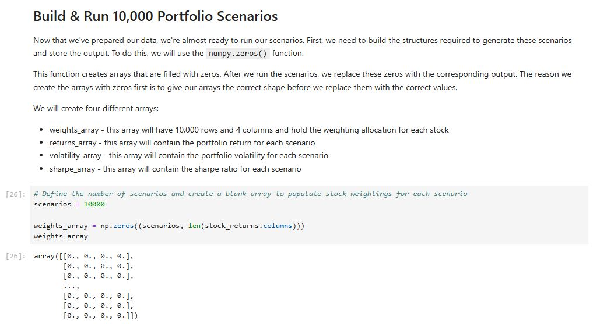
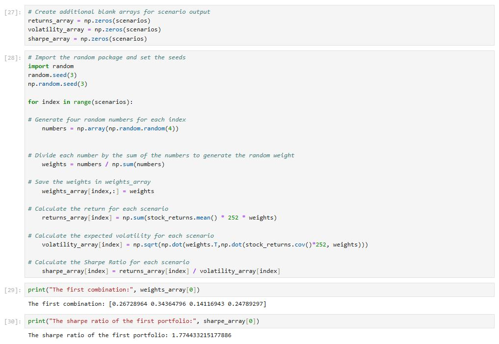
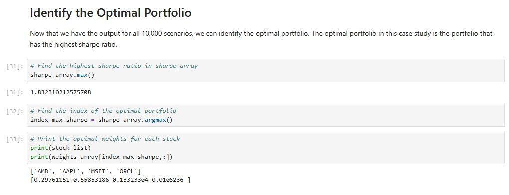

